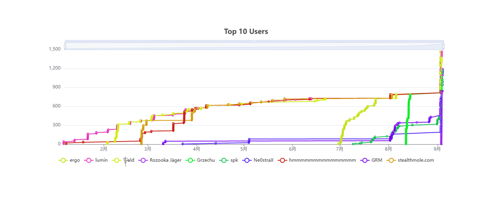
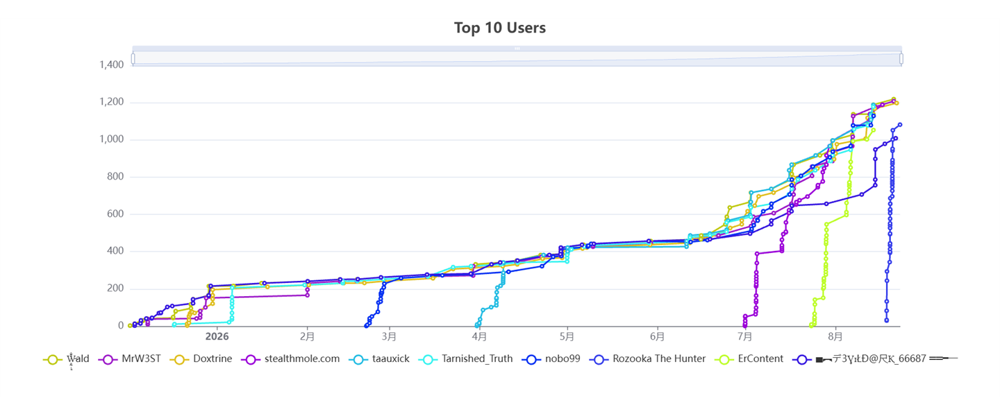

# Yann

_{ I build systems for questions a search box cannot answer.

**Project ARGUS** turns fragments across images, maps, archives,
and the open web into traceable intelligence.

Search retrieves.

**ARGUS investigates.** }_

  

## Now

Building **Project ARGUS**, an agentic intelligence system for multimodal
investigation, autonomous research, and evidence-backed results.

> Reduce the distance between an unknown and a verified answer.

## Fieldwork

**Two platforms. Two days. Two global Top 10s.**

| OSINT UK | OSINT Industries |
|:---:|:---:|
|  |  |
| **Peak Global #4** Reached within 48 hours | **Peak Global #8** Reached within 48 hours Officially banned — apparently the leaderboard had a speed limit.   |
| [Leaderboard](https://ctf.osint.uk/scoreboard) | [Leaderboard](https://osintindustries.ctfd.io/scoreboard) |

## Highlights

| Highlight | Detail |
|---|---|
| **Project ARGUS** | A many-eyed system that turns fragmented public information into traceable intelligence |
| **Engineering** | Agent orchestration, multimodal analysis, autonomous research, and evidence resolution |
| **Operating Range** | Images, identities, locations, timelines, archives, and the open web |
