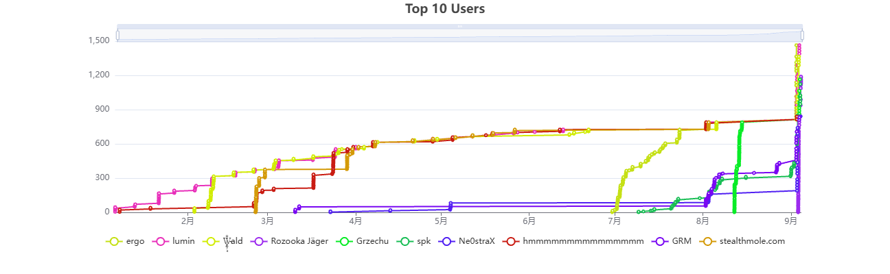
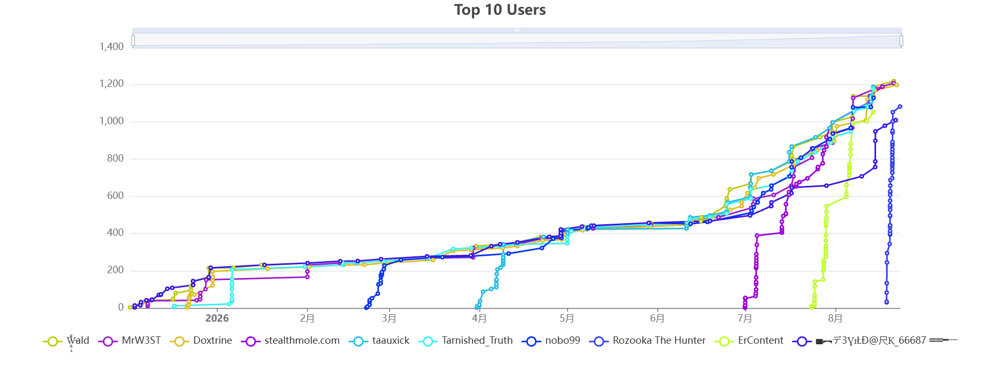

# Yann

_{ I build systems for questions a search box cannot answer.

**Project ARGUS** is a many-eyed intelligence system that follows
fragments across images, maps, archives, and the open web —
then turns them into findings you can trace.

I took the method into the field:

**#8 globally on OSINT Industries. 
#4 globally on OSINT UK. 
Both reached within 48 hours.**

Search retrieves.

**ARGUS investigates.** }_

---

## Now

Building **Project ARGUS** — an agentic intelligence system for
multimodal investigation, autonomous research, and evidence-backed results.

Current objective:

> Reduce the distance between an unknown and a verified answer.

---

## Field Results

### OSINT UK — Peak Global #4

**Two days from entry to the global Top 10.**

  

### OSINT Industries — Peak Global #8

**Reached the global Top 10 within the same 48-hour run.**

  

> **Two platforms. Two days. Two global Top 10s.**

---

## Highlights

| Highlight | Detail |
|---|---|
| **Project ARGUS** | A many-eyed system that turns fragmented public information into traceable intelligence |
| **Global OSINT — #4** | Peak global rank on [OSINT UK](https://ctf.osint.uk/scoreboard) |
| **Global OSINT — #8** | Peak global rank on [OSINT Industries](https://osintindustries.ctfd.io/scoreboard) |
| **From Entry to Top 10** | Reached both global leaderboards within 48 hours |
| **Engineering** | Agent orchestration, multimodal analysis, autonomous research, and evidence resolution |
| **Operating Range** | Images, identities, locations, timelines, archives, and the open web |
